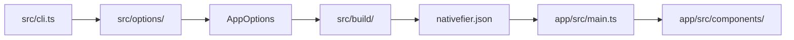

# Nativefier Architecture

This document describes how the repository is split into layers and how configuration flows from the CLI into a packaged desktop app.

## Layers

| Layer | Path | Role |
| --- | --- | --- |
| **Shared contract** | `shared/src/` | TypeScript types and constants used by both build-time and runtime. No Electron, no filesystem packaging. |
| **Build-time** | `src/` | CLI (`cli.ts`), option normalization, inference, and the builder (`build/`). Runs on the developer machine when invoking `nativefier`. |
| **Runtime template** | `app/src/` | Electron main process, preload, and UI helpers copied into every generated app. Runs inside the packaged app. |

Compiled output mirrors sources: `lib/` (CLI), `app/lib/` + `app/dist/` (runtime bundle), `shared/lib/` (types only, consumed via project references).

## Import rules

1. **`app/src/` must not import from `src/`** (builder/CLI). Runtime cannot depend on build-time code.
2. **`src/` must not import from `app/src/`** except by copying the app template directory at build time, not via TypeScript imports.
3. **Both layers import shared types through entry modules:**
   - Build-time: `src/buildTimeContract.ts`
   - Runtime: `app/src/runtimeContract.ts`
4. Direct imports from `shared/src/options/model.ts` are discouraged; prefer `buildTimeContract` or `runtimeContract` so boundaries stay obvious in code review.

ESLint enforces (1) and (2) with `no-restricted-imports` on all of `app/src/**/*.ts` and `src/**/*.ts` (including the contract entry files).

**Published npm package:** only `lib/` is shipped (see `.npmignore`). `buildTimeContract.ts` inlines `NATIVEFIER_JSON_FILENAME` and re-exports types only (erased at compile); it must not `require` `shared/lib` at runtime. Keep that constant in sync with `shared/src/contract.ts`.

## Configuration transport: `nativefier.json`

The only supported channel from builder to packaged app is a JSON file next to the app resources:

- **Constant:** `NATIVEFIER_JSON_FILENAME` in `shared/src/contract.ts` and `src/buildTimeContract.ts` (must match; CLI uses the latter in published builds)
- **Writer:** `mapAppOptionsToOutputOptions()` in `src/options/outputOptionsMapper.ts` (driven by `OUTPUT_FIELD_MAPPINGS`) writes `OutputOptions` during `prepareElectronApp()`.
- **Reader:** `app/src/config/loadRuntimeConfig.ts` loads and validates `nativefier.json` at startup; components receive `OutputOptions` from `main.ts`.

Do not pass new settings across the boundary by importing builder modules into `app/src/`. Add fields to the shared option types, extend `OUTPUT_FIELD_MAPPINGS` (and `optionSchema.ts` for CLI), and read them from `nativefier.json` in runtime.

## Where to change things

| Change | Start here |
| --- | --- |
| New CLI flag / default / validation | `src/options/optionSchema.ts` (metadata + mapping), `src/cli.ts` (positionals only), `shared/src/options/model.ts` (types) |
| New field in packaged app config | `shared/src/options/model.ts`, `OUTPUT_FIELD_MAPPINGS` in `outputOptionsMapper.ts`, runtime consumer in `app/src/` |
| Packaging / icons / Electron download | `src/build/` |
| Window, tray, menus, preload behavior | `app/src/` (Electron API via `app/src/adapters/`) |
| Runtime config load/validate/persist | `app/src/config/` |
| Cross-layer constant (e.g. config filename) | `shared/src/contract.ts` |

## Data flow (high level)

## Related docs

- [HACKING.md](../HACKING.md): setup, tests, contribution guidelines
- [API.md](../API.md): user-facing CLI options
